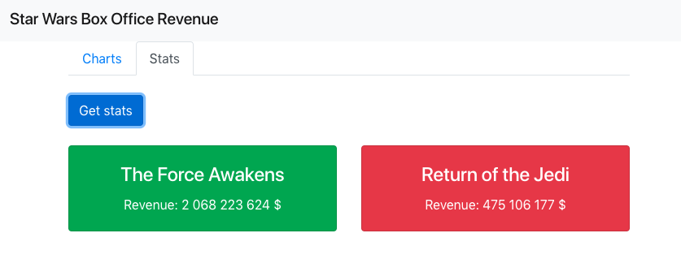
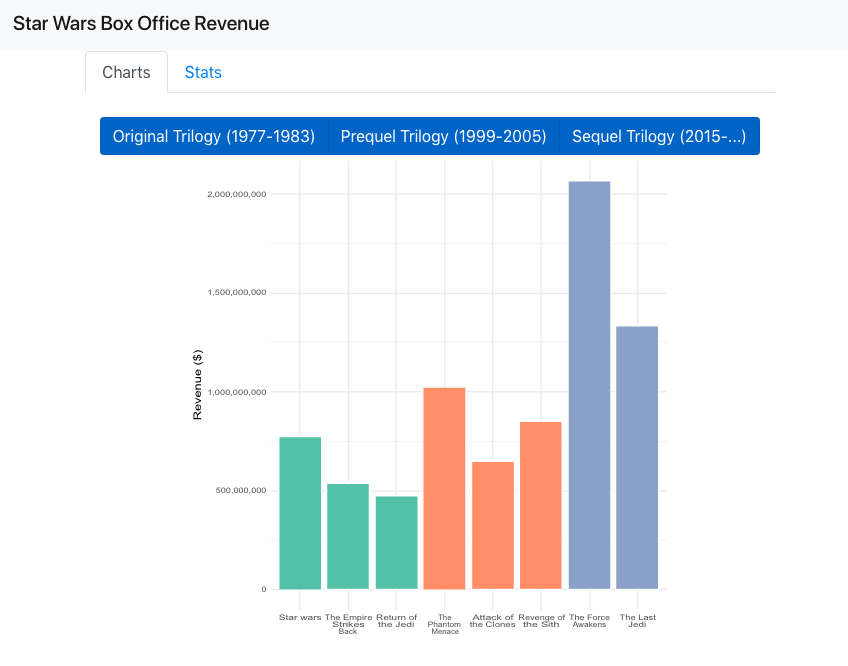

# Java + R = ❤

> Demo project for Java and R using GraalVM

> Inspired by: https://github.com/graalvm/graalvm-demos/tree/master/spring-r 


This demo has two parts:
* R script with several functions invoked by the Java part of the app
  * `plotRevenue`: it uses objects/classes from Java
  * `revenueStats`: for showing how to use a map as result of the function
* Java app using the R functions to process the data


## Build

```
mvn package
```


## Run

```
mvn exec:java
```

Open your browser: `http://localhost:4567/`



